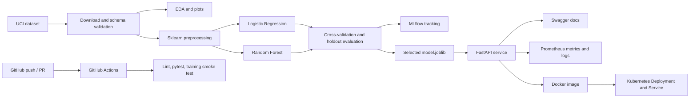

# Architecture diagram

```mermaid
flowchart LR
 U[UCI dataset] --> D[Download and schema validation]
 D --> E[EDA and plots]
 D --> P[Sklearn preprocessing]
 P --> LR[Logistic Regression]
 P --> RF[Random Forest]
 LR --> CV[Cross-validation and holdout evaluation]
 RF --> CV
 CV --> ML[MLflow tracking]
 CV --> M[Selected model.joblib]
 M --> API[FastAPI service]
 API --> DOCS[Swagger docs]
 API --> MET[Prometheus metrics and logs]
 API --> DO[Docker image]
 DO --> K8S[Kubernetes Deployment and Service]
 G[GitHub push / PR] --> CI[GitHub Actions]
 CI --> TEST[Lint, pytest, training smoke test]
```
